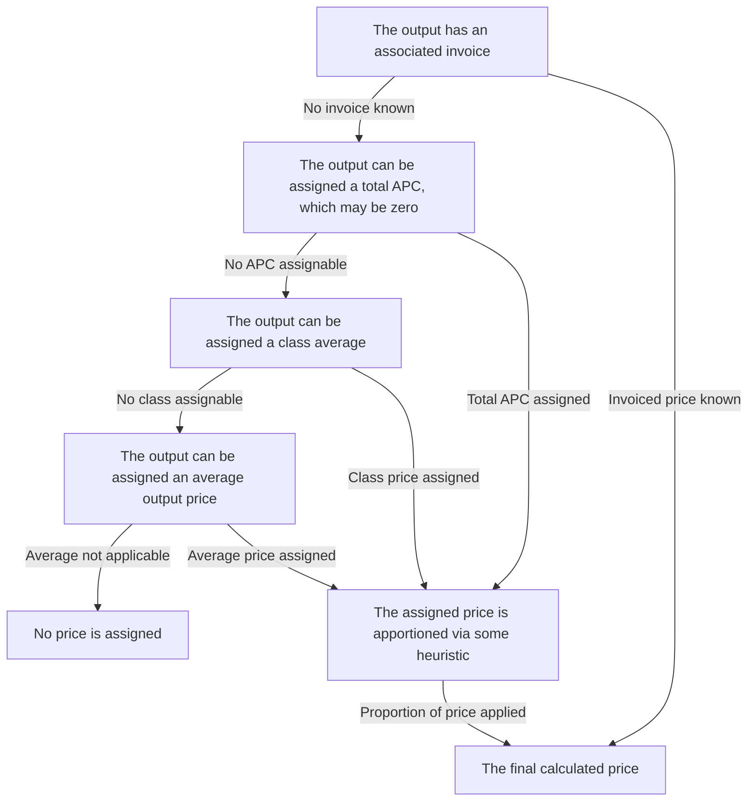
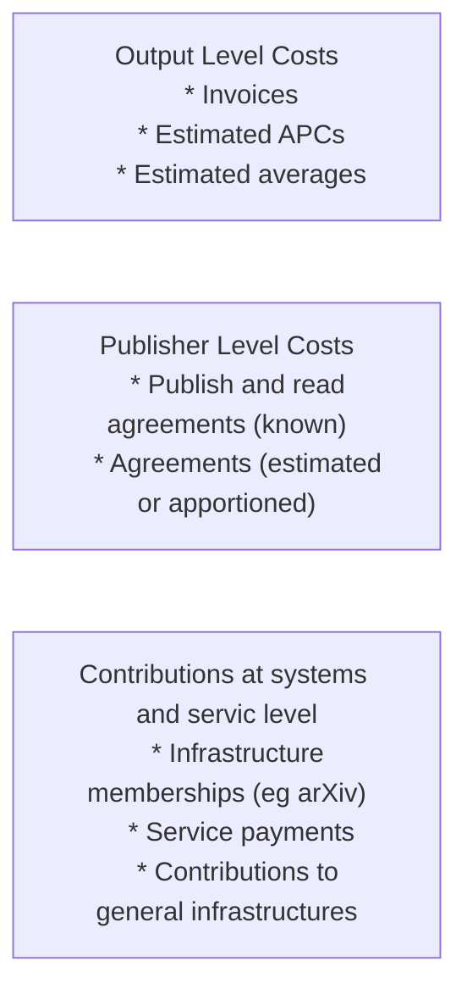

# publication-costs-model
A set of utilities for modelling the costs of scholarly publishing at institutional level

# Conceptual Model

The PCM provides a standard way of modelling the costs associated with scholarly publishing. 
The conceptual model is based on categories of cost, within which sets of outputs can be located.
The model is based on two core restrictions:

* Any specific money paid must appear in one and only one category
* Any specific output must appear (explicitly or conceptually) only once in any given category

Categories might include article-level charges such as APCs, read-and-publish agreements, contributions to
infrastructure costs (eg preprint archives or an institutional repository). Within each category a decision
tree is implemented which allows for the estimation of costs with as much accuracy and precision as possible.

As an example of a decision tree a specific implementation of APC estimation might follow, given a set of
outputs defined by their identifiers (which are determined separately).

Categories that are envisaged are broadly:

* Article level charges such as APCs, identifiable invoices and potentially ancillary publishing charges such as a colour and page charges
* Publisher level charges, such as publish-and-read agreements
* Service level charges, such as subscriptions to platforms, memberships fees or contributions to running costs
* Internal costs such as the running of a repository, relevant assigned staff costs etc

Each of these categories can have outputs associated with it. In the case of article level charges 
these outputs (and their associated metadata) can be used as part of the estimation of costs. In the
other cases the primary use case for associating outputs is estimating and apportioning estimates of
the cost-per-output. 

There is cross talk between publisher level charges and article level charges. An output that is included
in a publish-and-read agreement will not attract an APC (more specifically will be assigned an APC of 
zero). In the case of a capped PAR agreement it may be the case that outputs that would have qualified
will now attract an APC. Heuristics will be required to identify if a cap has been reached (see for 
example the [CAUL website](https://caul.libguides.com/read-and-publish/springer-nature) where the date 
of caps being reached is estimated alongside cap size).

